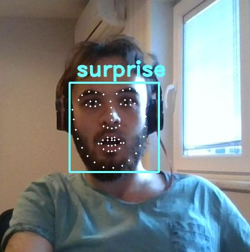

# Real-time Emotion Detection


## Abstract
8 emotions detected in real-time with \~77% accuracy. Used: OpenCV, Python 3, Keras, Data Preprocessing, Deep Learning & Machine learning Techniques.

## Build
You can build the project by executing following bash file:

```bash
./build.sh
```

Build instructions are provided for Linux only, you can use the equivalent commands for other operating-systems.

Note that, if you have trouble with installing dllib library, you can check out the [link](https://www.pyimagesearch.com/2018/01/22/install-dlib-easy-complete-guide/).

## Run
After build, you can enter the following command in your Linux Terminal to run the program:

```bash
./run_all.sh
```
Note that, you will get emotion detection results live and periodically. You can run "main.py" with "python3" if you want to see the emotion detection results in console. 

## Dataset 
**Name:** Cohn-Kanade (CK and CK+) Dataset

**Source:** http://www.consortium.ri.cmu.edu/ckagree/
 

## Contributors
- *Berk Sudan*, [GitHub](https://github.com/berksudan), [LinkedIn](https://linkedin.com/in/berksudan/)
- *İrem Şahin*, [GitHub](https://github.com/iremss),  [LinkedIn](https://linkedin.com/in/sahinirem/)

## References
- Facial landmarks with dlib, OpenCV, and Python: https://www.pyimagesearch.com/2017/04/03/facial-landmarks-dlib-opencv-python/
- Kanade, T., Cohn, J. F., & Tian, Y. (2000). Comprehensive database for facial expression analysis. Proceedings of the Fourth IEEE International Conference on Automatic Face and Gesture Recognition (FG'00), Grenoble, France, 46-53.
- Lucey, P., Cohn, J. F., Kanade, T., Saragih, J., Ambadar, Z., & Matthews, I. (2010). The Extended Cohn-Kanade Dataset (CK+): A complete expression dataset for action unit and emotion-specified expression. Proceedings of the Third International Workshop on CVPR for Human Communicative Behavior Analysis (CVPR4HB 2010), San Francisco, USA, 94-101.
